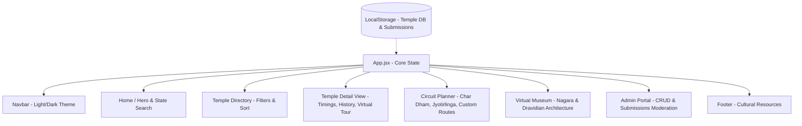

# Implementation Plan - India Temple Heritage & Pilgrimage Information Portal

A centralized, responsive, and visually stunning web application detailing India's temple heritage. This project is structured as a premium internship project submission for **Unified Mentor** & **Incredible India**.

---

## User Review Required

> [!IMPORTANT]
> - **Styling**: I will implement custom **Vanilla CSS** with CSS custom properties (variables) for theme management (Light/Dark mode), modern typography (Playfair Display for headers, Inter for text), and visual polish (glassmorphism, micro-interactions, layout transitions).
> - **Database / Persistence**: The portal will use an in-memory & `localStorage`-backed React State Database initialized with high-quality mock data of 8-10 major Indian temples (Kedarnath, Kashi Vishwanath, Tirupati, etc.). This ensures it is zero-setup and runs instantly for the internship mentors without setting up a separate MongoDB/PostgreSQL instance locally.
> - **Admin Credentials**: The admin module will be secured with a login (default: `admin` / `Venky123`) to simulate authentication and provide the internship mentors with an easy way to experience the content moderation flow.

---

## Proposed Project Architecture & Components

We will build the frontend using React (Vite) and structure it as follows:

---

## Proposed Changes

We will generate a new React workspace in `d:\farw\Temples` using `npx create-vite@latest ./ --template react --no-interactive --overwrite`.

### Project Structure & Base Files

#### [NEW] [index.html](file:///d:/farw/Temples/index.html)
- Updated with links to Google Fonts (Playfair Display, Inter) and FontAwesome for icons.
- Setting metadata, title, and responsive viewport.

#### [NEW] [src/index.css](file:///d:/farw/Temples/src/index.css)
- Core design system:
  - Global theme variables (light, dark, glass effect, warm amber/gold accents to fit the Indian heritage theme).
  - Modern animations (fade-in, slide-up, pulse-rings).
  - Custom scrollbars, buttons, form controls, and grid utilities.

#### [NEW] [src/data/temples.js](file:///d:/farw/Temples/src/data/temples.js)
- Rich static dataset of 9 famous Indian temples:
  - **Kedarnath** (Uttarakhand) - Jyotirlinga, Shiva, Nagara architecture
  - **Kashi Vishwanath** (Uttar Pradesh) - Shiva, historical importance
  - **Tirupati Balaji** (Andhra Pradesh) - Venkateswara, Dravidian architecture
  - **Meenakshi Amman** (Tamil Nadu) - Meenakshi/Sundareswarar, complex rituals
  - **Jagannath Temple** (Odisha) - Krishna/Jagannath, Chariot Festival
  - **Sun Temple** (Konark, Odisha) - Kalinga architecture, UNESCO Heritage
  - **Brihadeeswarar Temple** (Thanjavur, Tamil Nadu) - Chola heritage, Dravidian style
  - **Golden Temple** (Amritsar, Punjab) - Sikh heritage, unique architecture
  - **Somnath Temple** (Gujarat) - First Jyotirlinga, historical rebuilds
- Each temple contains:
  - Location details (City, State, Region)
  - Historical summary and legends
  - Deity details and temple style
  - Dress code, guidelines, and rules
  - Daily Aarti & Darshan timings (with time ranges for open/close)
  - Interactive coordinates (simulated map location)
  - Nearby facilities (accommodation, transport, restaurants)
  - High-quality visual imagery reference (using premium stock photos)

---

### UI Components

#### [NEW] [src/components/Navbar.jsx](file:///d:/farw/Temples/src/components/Navbar.jsx)
- Navigation bar with brand logo ("Bharat Heritage"), theme toggler, page links (Home, Temples, Circuits, Museum, Admin), and quick search access.

#### [NEW] [src/components/Hero.jsx](file:///d:/farw/Temples/src/components/Hero.jsx)
- A visually stunning landing section with a background slideshow, statistical counters (Temples Listed, States Covered, Pilgrim Visits), and an interactive search bar with instant autocomplete.

#### [NEW] [src/components/TempleCard.jsx](file:///d:/farw/Temples/src/components/TempleCard.jsx)
- Compact grid card for temple display. Includes:
  - Image hover zoom effects.
  - Deity and state badges.
  - **Live Timing Status Badge**: Programmatically calculates if the temple is currently "Open", "Closed", or in "Aarti" based on actual local hours.
  - Click to view details action.

#### [NEW] [src/components/DetailView.jsx](file:///d:/farw/Temples/src/components/DetailView.jsx)
- In-depth look at a selected temple. Features:
  - Parallax banner.
  - Dynamic Tabs:
    - **Overview & History**: Rich narrative, deity description, timeline.
    - **Rituals & Timings**: Detail chart of poojas and aartis.
    - **Guidelines & Amenities**: Dress code, strict taboos, wheelchair accessibility, transport connections, and hotel details.
    - **User Notes**: A local reviews block allowing users to submit feedback and tips (persisted in local storage).

#### [NEW] [src/components/CircuitPlanner.jsx](file:///d:/farw/Temples/src/components/CircuitPlanner.jsx)
- A guided trip-planning tool featuring:
  - Popular circuits like Char Dham, Jyotirlinga (North/West), Pancha Bhuta (South India).
  - Map route visualization (interactive path, node markers, travel mode, days needed).
  - Checklist tracking (hotel booked, transport, guide, pooja slots) saved to local storage.
  - "Custom Circuit Builder" allowing users to add custom temples, order them, and save their own customized route.

#### [NEW] [src/components/VirtualMuseum.jsx](file:///d:/farw/Temples/src/components/VirtualMuseum.jsx)
- Heritage appreciation section.
- Informational tabs explaining Temple Architecture Styles:
  - **Nagara Style** (Northern)
  - **Dravidian Style** (Southern)
  - **Vesara Style** (Hybrid)
- Includes animated SVG visual guides, detailed architectural terms glossary (Gopuram, Vimana, Mandapa, Garbhagriha), and cultural conservation initiatives.

#### [NEW] [src/components/AdminPanel.jsx](file:///d:/farw/Temples/src/components/AdminPanel.jsx)
- A secure moderation panel:
  - Password lock screen (`admin` / `Venky123`).
  - **Analytics Panel**: Key metrics (listed count, user submittals, visitor notes stats, category distribution chart using dynamic CSS bar graphics).
  - **CRUD Operations**: Edit existing temples or add a new temple (with complete validation).
  - **Approval Queue**: View and approve user-submitted temple draft suggestions.

#### [NEW] [src/App.jsx](file:///d:/farw/Temples/src/App.jsx)
- Handles core routing, state synchronization, theme propagation (adding `dark` class to HTML/body), local storage initialization, and dashboard assembly.

---

## Verification Plan

### Manual Verification
1. **Responsive Testing**: Confirm design adaptability on Desktop (1920x1080), Tablet (iPad Air), and Mobile (iPhone 14) widths.
2. **Theme Toggling**: Validate that Dark/Light mode transitions all colors smoothly and persists through page reloads.
3. **Admin CRUD**:
   - Log into Admin Panel.
   - Add a new temple. Verify it appears on the temple directory page immediately.
   - Edit an existing temple. Verify changes are updated.
   - Delete a temple. Verify it is removed.
4. **Search and Filter Mechanics**: Try searching by deity (e.g., Shiva), filtering by state (e.g., Tamil Nadu), and sorting by name or historical age.
5. **Circuit Planner**: Select a circuit, mark items on the check-list, reload page, and verify the status is saved. Create a custom circuit and test it.
6. **Live Timing Badge**: Artificially mock current hours to verify that the "Open", "Closed", and "Aarti" badge changes appropriately.
